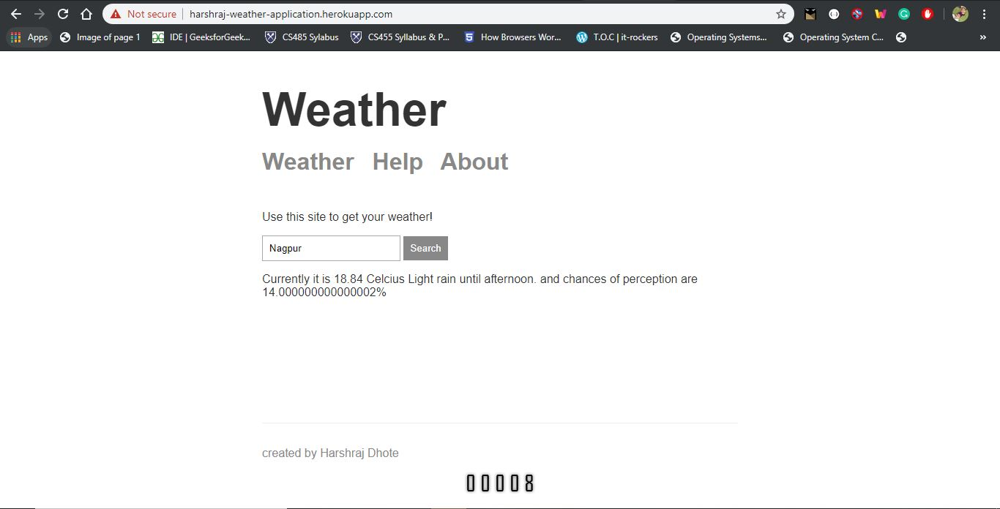

# Weather-App
A node js based web app for fetching weather information of different locations.
for running the app your need to create your account on mapbox.com for getting geocode access token then add that into the util->geocode.js file on line 3 further comments are provided there.
also generate your link for the climate data fetching from the darksky.net/dev and add your link there in util->geocode.js file where comment is provided

 link to website http://harshraj-weather-application.herokuapp.com/
